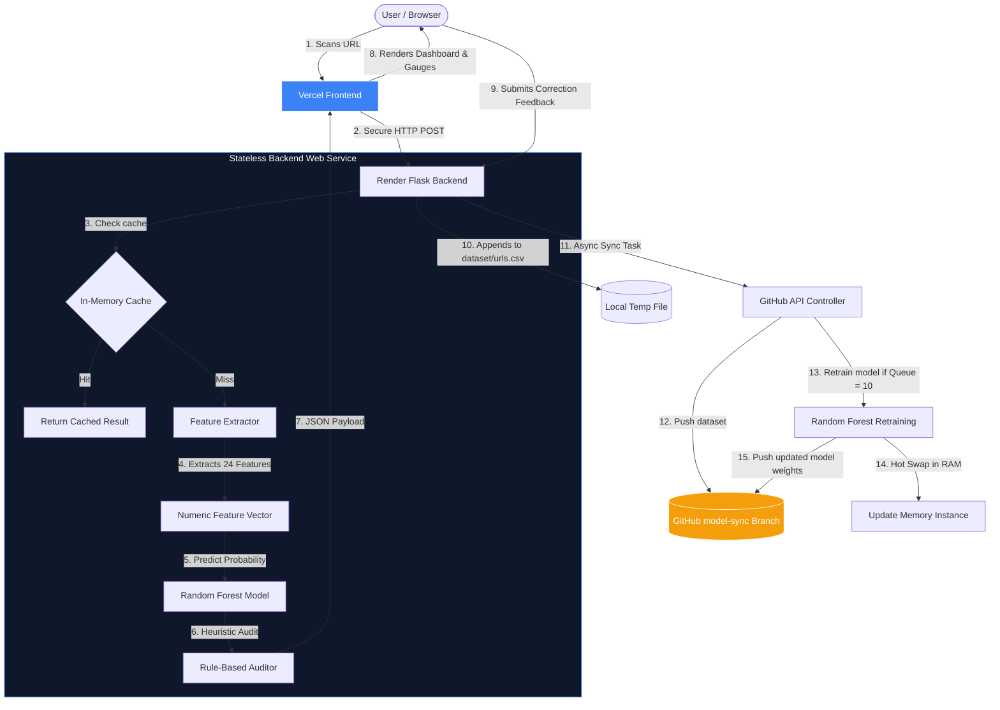

# PhishGuard: Project Presentation 🛡️

Welcome to **PhishGuard**, an intelligent, real-time phishing threat auditor. This document is designed for technical recruiters, hiring managers, and system architects. It highlights the engineering decisions, system design patterns, and machine learning pipeline that make PhishGuard a highly efficient, production-ready security tool.

---

## 🚀 Executive Summary
* **Problem**: Traditional phishing filters rely on static blacklists (e.g., Google Safe Browsing), which fail to block zero-day phishing subdomains generated dynamically by attackers.
* **Solution**: An AI-powered threat auditor utilizing a **Random Forest Classifier** trained on 24 lexical, structural, and heuristic URL features. 
* **Key Innovation**: A stateless, self-retraining MLOps feedback loop that evolves the model automatically in production based on user corrections—operating 100% free on cloud tiers.
* **Core Metrics**:
  * **Inference Latency**: `< 5ms` per URL scan.
  * **Model Evaluation**: **99.5% Accuracy** via Stratified 5-Fold Cross-Validation.
  * **Retraining Cost**: `$0.00` (utilizing a stateless Git-backed database architecture).

---

## 🎨 Tech Stack
* **Backend**: Python 3.13, Flask, Scikit-learn, Pandas, Gunicorn.
* **Frontend**: Vanilla HTML5, CSS3, JavaScript (ES6+), Chart.js (Real-time analytics).
* **CI/CD & DevOps**: GitHub Actions, Vercel (static web hosting), Render (WSGI API hosting).

---

## 📐 System Architecture & MLOps Pipeline

---

## 💡 Key Engineering Challenges & Solutions

### 1. Bypassing Ephemeral Disk Constraints on Free Cloud Hosting (Render)
* **The Challenge**: Render’s free web services run on a stateless container with an ephemeral disk. Every 15 minutes of inactivity, the container spins down, and once it boots back up, any locally saved model weights or newly submitted dataset rows are permanently wiped.
* **The Solution**: 
  1. We separated our git repo into a **Code Branch (`main`)** and a **Data/Model Branch (`model-sync`)**.
  2. Whenever a user submits feedback, the backend appends it to `urls.csv` and asynchronously pushes it to the `model-sync` branch on GitHub using the Contents API.
  3. **On Startup Synchronization**: Every time the container boots up or wakes from sleep, the Flask app automatically queries GitHub and downloads the latest `urls.csv`, `model.pkl`, and `model_metadata.json` from the `model-sync` branch before accepting traffic.
  4. This provides **100% data persistence and model evolution** on a zero-budget infrastructure.

### 2. Eliminating Redundant Deployment Rebuild Loops
* **The Challenge**: In a naive implementation, pushing updated models to GitHub would trigger Render to rebuild and redeploy the service, knocking the API offline for 2 minutes on every user feedback submission.
* **The Solution**:
  * We set Render's deployment branch to watch `main` (only code changes).
  * The backend pushes database backups and model updates to the separate `model-sync` branch.
  * Since Render is not watching `model-sync`, **these data pushes never trigger redeployments**. The live app stays 100% online, maintains its in-memory metrics, and updates its active classification weights seamlessly in RAM.

### 3. Mitigating Ephemeral Cold Start Delay (Premium UX)
* **The Challenge**: Render's free tier sleeps after 15 minutes, causing a 50–60 second delay on the first connection.
* **The Solution**: Added an interactive **Hacker Terminal Boot Sequence** on the Vercel frontend. When it detects a cold start, it displays a retro terminal loading log and a textual progress bar (`[#####..........] 30%`). It polls the backend silently in the background, smoothly transitioning to the dashboard the instant a connection is established.

---

## 🧠 Machine Learning Engine

### Why Random Forest over Deep Learning?
While CNNs or LSTMs are common for text classification, they introduce significant latency, require heavy GPU resources, and cannot easily be retrained on the fly. 
* **Speed**: Random Forest makes binary classification decisions in **`< 5ms`**, satisfying real-time gateway security requirements.
* **Resource Friendly**: It runs on standard low-power CPU instances.
* **Online Retraining**: Re-fitting the ensemble tree model on our feedback database takes less than **3 seconds** in a background thread, enabling live hot-swapping in production.

### The 24-Feature Vector Pipeline
PhishGuard extracts lexical, structural, and complexity markers from raw URL strings. Examples include:
* **Lexical**: URL Length, Subdomain Count, Dots Count, Digit Ratios, Shannon Entropy (measures domain text complexity).
* **Structural**: IP Address hosts, suspicious port bindings, `@` character redirection detection.
* **Heuristics**: Visual brand-spoofing (checking for domains like `secures-paypal.com` using Typosquatting heuristics).

---

## 💬 Recruiter & Hiring Manager Q&A

**Q: "How does the backend hot-swap the model in production without downtime?"**
> *"When the pending feedback queue reaches 10, a background worker starts. It fits the new Random Forest classifier on the updated dataset, saves the pickle file, and then updates the global variable pointing to the model instance in memory. Since Python variables are references, all incoming scan requests immediately route to the new model pointer with zero downtime."*

**Q: "Why pin dependencies like scikit-learn explicitly?"**
> *"Python's `pickle` library is highly sensitive to package versions. If the version of scikit-learn used to train the baseline model locally differs from the version on the web server, loading the model will crash on startup. Pinning version `1.8.0` ensures absolute pickle compatibility between environments."*

**Q: "How is the queue size calculated dynamically without storing local files?"**
> *"To avoid state corruption on stateless container restarts, the queue size is calculated on demand by comparing the row count of `urls.csv` with the `samples_count` logged inside `model_metadata.json` (which records the exact number of samples the active model was trained on). The difference is the pending queue size."*
