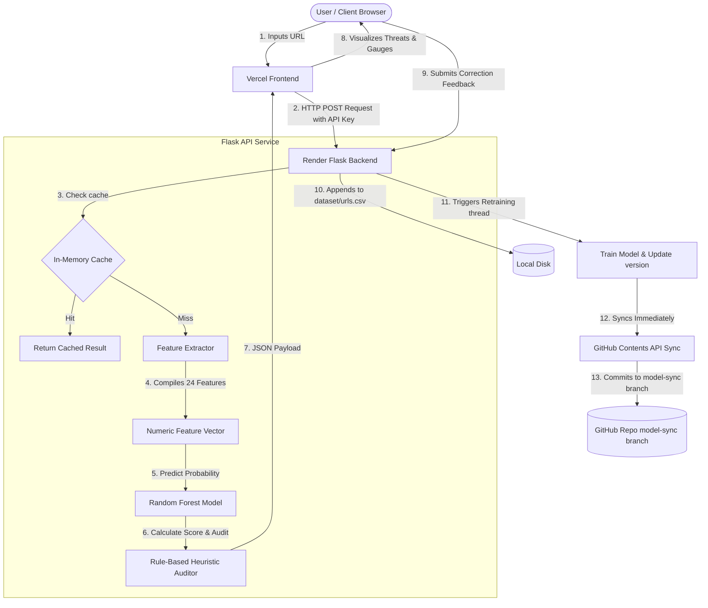

# PhishGuard B.Tech Project Presentation Guide 🎓

This guide serves as a comprehensive preparation sheet for presenting PhishGuard as a B.Tech Final Year / Semester project. It outlines the architecture, data pipeline, Machine Learning choices, and answers to common defense questions from examiners.

---

## 1. Project Overview & Pitch
* **Title**: PhishGuard: Intelligent Real-Time Phishing Threat Intelligence Auditor
* **Core Problem**: Traditional security filters rely heavily on static blacklists (e.g., Google Safe Browsing). They fail to catch **zero-day phishing domains** generated dynamically.
* **The Solution**: PhishGuard uses a **Random Forest Classifier** trained on 24 lexical and structural features of a URL. It evaluates risk in milliseconds and features a **user feedback self-retraining loop** that automatically adapts the model over time.
* **Architecture Style**: Decoupled SaaS-Dashboard architecture.
  * **Backend**: Flask API (Python) deployed on Render (free tier).
  * **Frontend**: Vanilla HTML5/CSS3/JS Web App deployed on Vercel.

---

## 2. System Architecture Workflow

---

## 3. The 24-Feature ML Pipeline
When an examiner asks, *"How does your AI know if a link is fake?"*, you explain that PhishGuard extracts **24 characteristics** from the raw string. These are grouped into three categories:

| Feature Name | Category | Description |
| :--- | :--- | :--- |
| **URL Length** | Lexical | Longer URLs are often used to hide malicious subdomains. |
| **Domain Length** | Lexical | Phishing domains tend to have longer hostname lengths. |
| **Path Length** | Lexical | Malicious URLs often have complex subdirectory structures. |
| **Dots Count** | Lexical | High number of dots indicates deep subdomain nesting. |
| **Hyphens in URL/Domain** | Lexical | Phishing links use dashes (e.g., `secure-paypal-login`) to look real. |
| **Subdomain Count** | Lexical | Evaluates the depth of subdomains. |
| **HTTPS Scheme** | Connection | Malicious URLs sometimes bypass SSL, or conversely, abuse free SSL. |
| **IP Address Presence** | Structural | True if the URL host is a raw IP (e.g. `http://192.168.1.1`). |
| **@ Symbol** | Structural | The `@` symbol ignores everything before it (e.g. `google.com@phish.com` goes to phish). |
| **Double Slash Path** | Structural | Presence of `//` in the path indicating redirect tricks. |
| **URL Shortener** | Structural | Uses tinyurl, bit.ly, etc., to obfuscate the destination. |
| **Non-Standard Port** | Structural | Uses ports other than 80/443 (e.g., `8080`, `21`). |
| **Suspicious TLD** | Domain | Uses low-cost TLDs (e.g., `.xyz`, `.fit`, `.cc`, `.tk`). |
| **Digit Ratio** | Lexical | Ratio of numbers in the URL (high numbers indicate random generation). |
| **Brand Spoofing** | Heuristic | Looks for brand keywords (e.g., `paypal`, `netflix`) outside official hostnames. |
| **Shannon Entropy** | Complexity | Measures random text complexity (high entropy indicates machine-generated domains). |
| **Vowel Ratio** | Lexical | Natural language words have balanced vowel ratios. Phishing domains don't. |
| **Host Keyword** | Heuristic | Domain hostname contains words like `secure`, `webscr`, `login`, `bank`. |
| **Consecutive Characters** | Complexity | Too many consecutive repeating symbols or dashes. |
| **Typosquatting** | Heuristic | Visual similarity checks (e.g., `paypa1`, `go0gle`). |
| **Domain Digit Count** | Lexical | Absolute count of digits inside the hostname. |
| **Query Parameters** | Lexical | Number of query variables in the search string. |
| **Consecutive Repeating Letters** | Complexity | Looks for visual duplication tricks. |

---

## 4. Machine Learning Model details
* **Algorithm**: Random Forest Classifier
* **Why Random Forest?**
  * It is an ensemble method combining multiple Decision Trees (default 150).
  * High accuracy on tabular/numeric features, prevents overfitting using bootstrap bagging, and executes predictions in **under 5 milliseconds**, making it optimal for real-time gateway blocking.
* **Validation Strategy**: **Stratified 5-Fold Cross-Validation**
  * Ensures every fold has the same percentage of safe and phishing samples, guaranteeing that cross-validation accuracy (currently **99.5%**) is reliable and not biased by imbalanced classes.

---

## 5. Defense Q&A: Common Examiner Questions

### Q1: *"Why did you use Random Forest instead of Deep Learning (like CNN/LSTM)?"*
* **Answer**: *"Deep Learning models require massive datasets, long training times, and expensive GPU resources. Random Forest runs predictions in under 5 milliseconds on a single CPU core, handles mixed numeric/binary tabular features beautifully, and can be retrained in under 3 seconds in our live feedback loop, which is critical for lightweight, free cloud deployments."*

### Q2: *"Render has an ephemeral disk. When it sleeps, doesn't it lose all the retrained models and feedback data?"*
* **Answer**: *"Yes, Render's free tier has an ephemeral disk that resets daily. We solved this constraint by designing an **MLOps data branch structure**. The backend pushes the updated `urls.csv`, `model_metadata.json`, and `model.pkl` to a dedicated **`model-sync`** branch. Render is configured to run the server from the `model-sync` branch. This preserves all self-evolving models across restarts, while keeping the developer's **`main`** branch commit history completely pristine."*

### Q3: *"Wait, doesn't pushing to GitHub trigger a continuous deployment build loop on Render/Vercel every time?"*
* **Answer**: *"No. We append `[skip ci]` to our git commit message. Both Render and Vercel read this tag and skip compiling a new build, preventing continuous deployment loops while securing our model files."*

### Q4: *"What is the purpose of the threshold slider on the frontend?"*
* **Answer**: *"The slider adjusts the decision boundary threshold of the model locally. The Random Forest model outputs a risk probability from 0% to 100%. By moving the slider, we can dynamically change the classification strictness (e.g., a 40% threshold flags suspicious links faster, whereas a 70% threshold reduces false alarms). This is done entirely client-side without retraining."*
