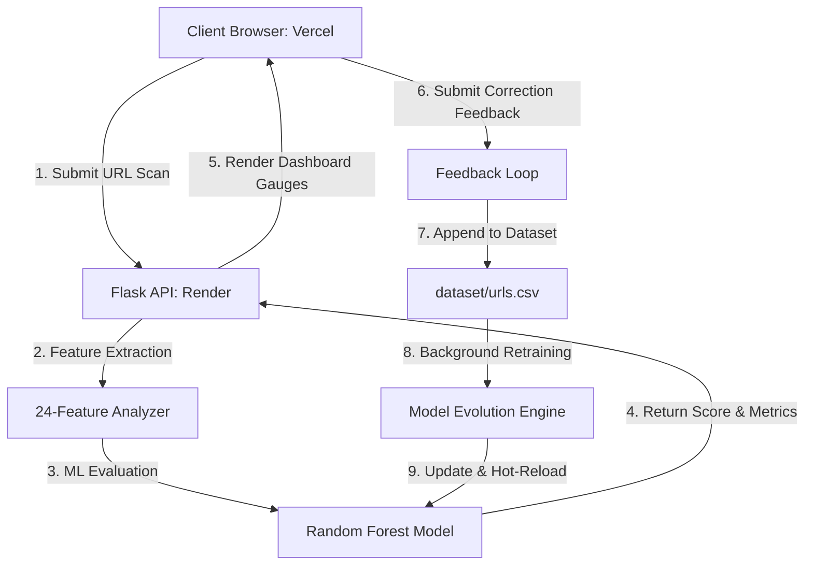

# PhishGuard 🔐

[](https://phish-guardx.vercel.app)
[](PROJECT_PRESENTATION.md)
[](https://python.org)
[](https://opensource.org/licenses/MIT)

PhishGuard is an intelligent, self-evolving machine learning phishing detector designed to analyze structural URL features and identify malicious links in real-time. It features an interactive cybersecurity dashboard, explainable AI diagnostics, and a dynamic feedback loop that retrains and hot-swaps the underlying model in memory without server downtime.

---

## 🛠️ Technology Stack

* **Frontend**:    
* **Backend**:  
* **Machine Learning**:   
* **Deployment**:  

---

## 🎯 Key Features

* **Self-Evolving Retraining Loop**: Users can submit correction feedback directly from the dashboard. The server appends this correction, runs retraining in a background thread, and hot-reloads the updated model in memory instantly.
* **Explainable AI (XAI)**: Exposes raw metric values for **24 advanced features** (structural, brand spoofing, entropy, etc.) in an expandable Inspector Table.
* **Heuristic Insights**: Maps mathematical probabilities back to clear, human-readable security risk cards (Critical, Warning, Info alerts).
* **Interactive Threshold Configuration**: Features a local sensitivity slider allowing users to adjust security strictness (Strict vs. Balanced vs. Permissive policy stances) dynamically.
* **Session Analytics**: Displays real-time safe vs. threat ratios inside the session using responsive Chart.js doughnut charts.
* **Secure API Endpoints**: Protected via `X-API-Key` headers to block unauthorized analysis or stats queries.

---

## ⚙️ System Architecture

PhishGuard splits concerns between a static edge-hosted client and a persistent ML container:



---

## 📊 The 24-Feature Extraction Engine

PhishGuard analyzes URLs based on 24 distinct features engineered to capture mathematical and semantic anomalies:

| Category | Feature Name | Description |
| :--- | :--- | :--- |
| **Length Metrics** | URL, Domain, & Path Lengths | Phishing links are often abnormally long. |
| **Structure** | Dots, Hyphens, Subdomains | Counts separators to flag deep obfuscations. |
| **Connection** | HTTPS Scheme, Non-Standard Ports | Verifies protocol security and network entry. |
| **Obfuscation** | IP Address, @ Symbol, Double Slash | Identifies cloaking techniques designed to mask destinations. |
| **Heuristics** | Brand Spoofing, TLDs, Shorteners | Sequence matcher to flag lookalike major brands and low-cost TLDs. |
| **Complexity** | Shannon Entropy, Vowel Ratio | Detects randomized Domain Generation Algorithms (DGA). |
| **Parameters** | Digit Ratios, Query Parameters | Tracks data payload complexity. |

---

## 🚀 Local Installation & Setup

### Prerequisites
* Python 3.13+
* Node.js / NPM (if running a local live server)

### 1. Clone the Repository
```bash
git clone https://github.com/NotSoAbhinav/PhishGuard.git
cd PhishGuard
```

### 2. Configure and Start Backend API
```bash
# Set up environment variables (Optional: defaults to dev keys)
# export PHISHGUARD_API_KEY=your_secret_key

# Install dependencies
pip install -r requirements.txt

# Run the local Flask server
python backend/app.py
```
The API is now running locally at `http://127.0.0.1:5000`.

### 3. Open the Frontend
Since the frontend uses Vanilla HTML/CSS/JS, you can open `frontend/index.html` directly in your browser or run a simple local live-server (e.g. `npx live-server frontend`).
* **Local Fallback**: The client script automatically falls back to `http://127.0.0.1:5000` and `default-dev-key` when running offline, making development immediate and friction-free.

---

## 🌐 Production Deployment

PhishGuard is deployed in a split-free cloud architecture:

1. **Backend (Render Web Service)**: Runs the Python environment and Gunicorn to host the Flask REST API.
2. **Frontend (Vercel)**: Serves the static HTML/CSS/JS files. During Vercel's build phase, it runs `replace_api_url.py` to securely replace credentials placeholders in `script.js` with environment variables.
